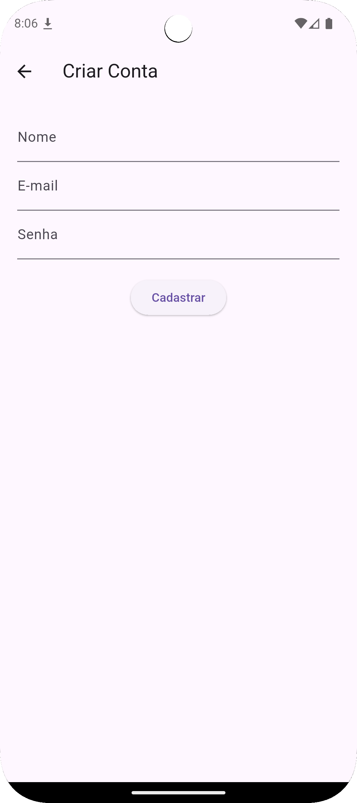
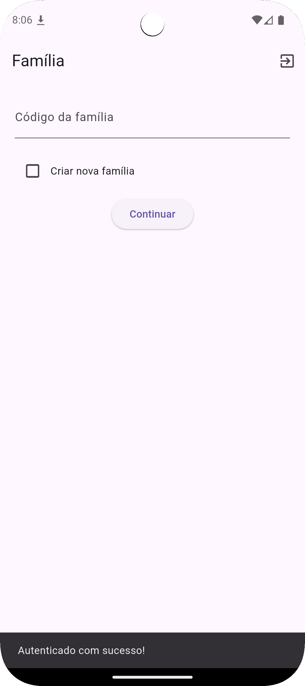
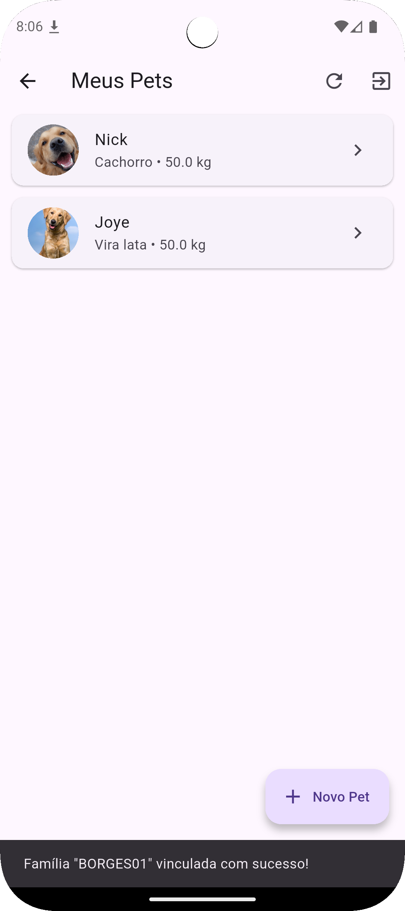
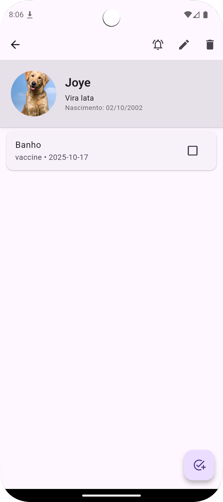
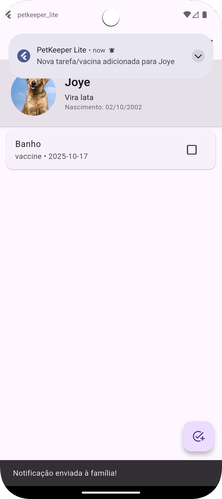
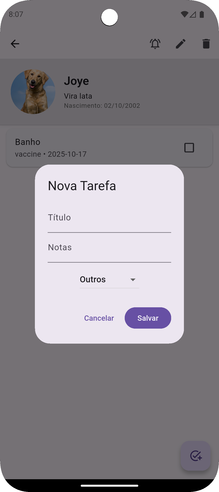
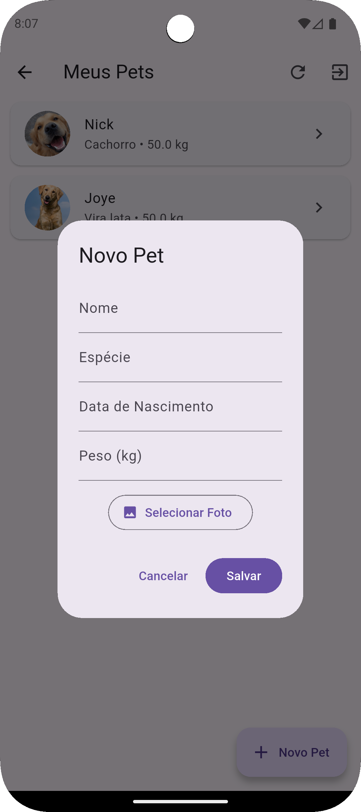

# 🐾 PetKeeper Lite

Aplicativo desenvolvido em Flutter para gerenciamento colaborativo de tarefas, vacinas e cuidados de pets entre membros de uma mesma família.  
Integra autenticação, notificações em tempo real e sincronização via Firebase.

---

## 📱 Funcionalidades

### 👨‍👩‍👧‍👦 Famílias
- Criação e ingresso em grupos familiares por **código único** (`familyCode`);
- Associação automática entre usuários e pets da mesma família;
- Isolamento total de dados entre famílias via regras do Firestore.

### 🐶 Pets
- Cadastro de pets com:
    - nome, espécie, peso, data de nascimento e foto;
- Upload da foto para **Firebase Storage** (`pet_photos/{petId}.jpg`);
- Exibição da imagem circular e dados principais no topo da tela;
- Listagem filtrada por família atual.

### 📋 Tarefas
- Criação, listagem e marcação de tarefas associadas ao pet;
- Atualização em tempo real via **StreamProvider (Riverpod)**;
- Tipos de tarefa: Vacina, Banho/Tosa e Outros;
- Interface intuitiva com `CheckboxListTile`.

### 🔔 Notificações
- Integração com **Firebase Cloud Messaging (FCM)**;
- Função Cloud Function `notifyFamily` que:
    - Busca todos os tokens da família;
    - Envia notificação multicast;
- Notificação local exibida no dispositivo via `flutter_local_notifications`.

### 🔐 Autenticação
- Login com **Google** e **E-mail/Senha** (Firebase Auth);
- Registro automático no Firestore em `users/{uid}`;
- Armazenamento do token local via `SharedPreferences`;
- Logout remove token e FCM associado.

### 🛡️ Segurança e App Check
- **Firebase App Check** configurado com modo `debug`;
- Regras de Firestore e Storage isolando famílias;
- Comunicação segura entre app e funções via App Check Token.

---

## 🧠 Arquitetura

